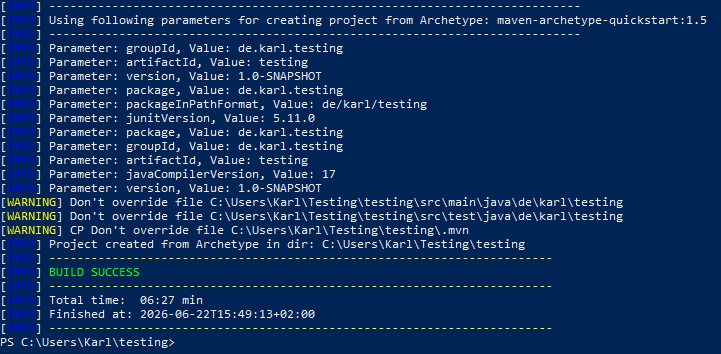
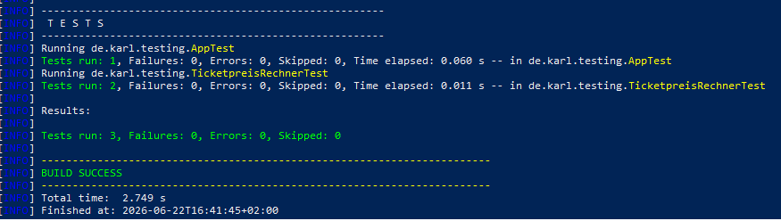
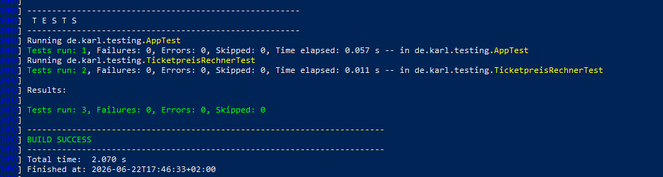
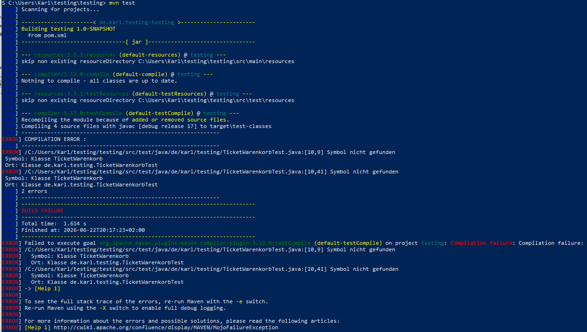
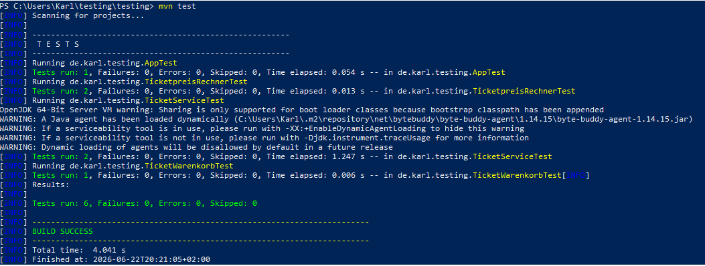
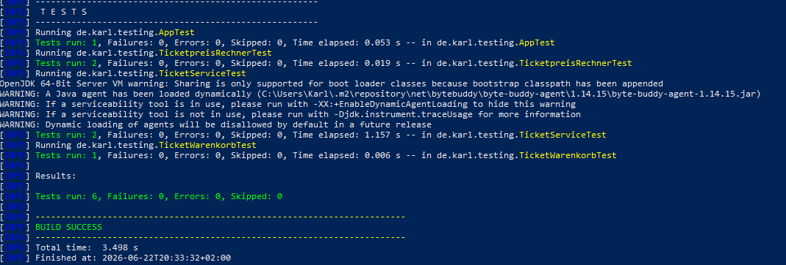
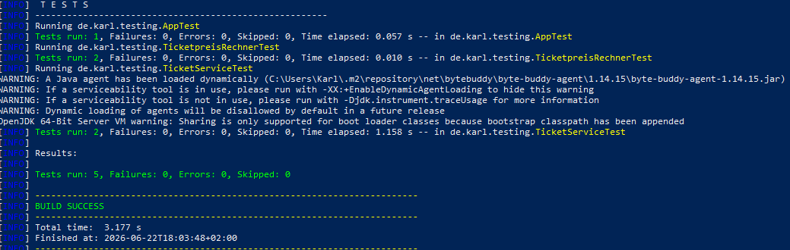

# Testing

## A1 Unit-Test

Ich habe für mein Projekt SpieltagPLUS eine eigene Klasse TicketpreisRechner entwickelt, die den Ticketpreis berechnet aus der Multiplikation Ticketanzahl und Preis pro Ticket.
Mit JUnit wurden zwei Tests durchgeführt:
- Test der korrekten Preisbrechnung
- TEst auf IllegalArgumentException, wenn man eine ungültige Ticketanzahl eingibt

Die Tests wurden mit mvn test ausgeführt und bestanden.

### Projekt angelegt



### Test



### Test nach Erweiterung




## A2 TDD

Ich habe hierfür eine Klasse Warenkorb für mein Projekt SpieltagPLUS entwickelt.

### RED

Zunächst habe ich einen Test geschrieben, obwohl die Klasse noch nicht existierte.

Der Test schlug also fehl.



---

### Green

Dann habe ich die Klasse implementiert.

Test war nun erfolgreich.



---

### AI

Für die Erstellen der ersten Lösung habe ich AI (ChatGPT) benutzt.
Der Prompt war: "Erstelle eine Java-Klasse TicketWarenkorb mit einer Methode berechneGesamtpreis(int anzahlTickets, double preisProTicket). Die Methode soll den Gesamtpreis berechnen. Schreibe außerdem passende JUnit-Tests."

AI Code:

```java
public double berechneGesamtpreis(int anzahlTickets,
                                  double preisProTicket) {
    return anzahlTickets * preisProTicket;
}
```
Funktionierte korrekt, jedoch berücksichigte die AI keinen Edge-Case, es war möglich mit folgender Eingabe ein negatives Gesamtergebnis zu haben; was beim Gesamtpreis Unsinn ist.

```java
berechneGesamtpreis(-3, 25.0);
```

Deshalb habe ich einen zusätzlichen Test erstellt, der eine Exception erwartet.

### Refactor Green

```java
public double berechneGesamtpreis(int anzahlTickets,
                                      double preisProTicket) {

        if (anzahlTickets < 0) {
            throw new IllegalArgumentException(
                    "Ticketanzahl darf nicht negativ sein");
        }

        return anzahlTickets * preisProTicket;
    }
```
    



## A3 Mocking

In meinem Projekt SpieltagPLUS ist der Bezahldienst eine unangenehme Methode, da ich eine zuverlässige Internetverbindung brauche, abhängig von von externen Anbietern bin etc.

Ein echter Bezahldienst würde z.B. PayPal oder einen anderen Zahlungsanbieter ansprechen.

Für Unit-Tests sollte diese externe Abhängigkeit nicht tatsächlich ausgeführt werden, folglich habe ich Mockito verwendet.

Ich habe ein Interface `BezahlService` erstellt und im `TicketService` verwendet.

Im Test wurde anschließend ein Mock-Objekt erzeugt.

Folgende Szenarien  getestet:

- erfolgreicher Ticketkauf
- fehlgeschlagener Ticketkauf

Dadurch konnte die Logik des TicketService getestet werden ohne einen echten Bezahldienst aufzurufen.

### Erfolgreicher Mocking-Test für beide Szenarien

Interface

```java
public interface BezahlService {
    boolean bezahle(double betrag);
}
```` 

Testklasse

```java
package de.karl.testing;

import static org.junit.jupiter.api.Assertions.assertEquals;
import static org.mockito.Mockito.*;

import org.junit.jupiter.api.Test;

public class TicketServiceTest {

    @Test
    void testTicketKaufErfolgreich() {

        BezahlService mockBezahlService = mock(BezahlService.class);

        when(mockBezahlService.bezahle(25.0)).thenReturn(true);

        TicketService ticketService =
                new TicketService(mockBezahlService);

        String ergebnis = ticketService.kaufeTicket(25.0);

        assertEquals("Ticket erfolgreich gekauft", ergebnis);
    }
    
    @Test
    void testTicketKaufFehlgeschlagen() {

        BezahlService mockBezahlService = mock(BezahlService.class);

        when(mockBezahlService.bezahle(25.0)).thenReturn(false);

        TicketService ticketService =
                new TicketService(mockBezahlService);

        String ergebnis = ticketService.kaufeTicket(25.0);

        assertEquals("Bezahlung fehlgeschlagen", ergebnis);
    }
}
```


---


